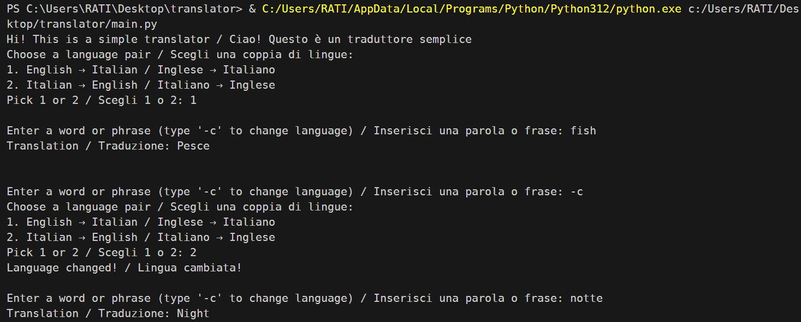

# ინგლისურ-იტალური & იტალიურ-ინგლისური თარჯიმანი

თარჯიმნის კონკრეტული კონსოლ აპლიკაცია საშუალებას გაძლევთ თარგმნოთ სასურველი სიტყვა ინგლისურიდან იტალიურ ან
იტალიურიდან ინგლისურ ენაზე. გაითვალისწინეთ, რომ თითოეულ ბაზაში ამჟამად არის 300+ სიტყვა.

# ფუნქციონალობა
ინსტრუქცია მოცემულია ორივე აღნიშნულ ენაზე. თავდაპირველად აპლიკაცია გთხოვთ აირჩიოთ სასურველი, შემდგომ კი 
შეგიძლიათ შეცვლა -c ღილაკის შეყვანით.

მაგალითი:

